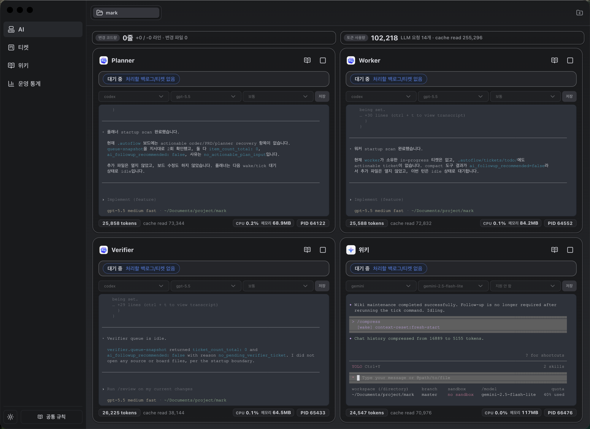

# Autoflow

Autoflow는 로컬 프로젝트에 AI 작업 보드를 설치하고, Codex / Claude Code 같은 로컬 에이전트 러너가 그 보드를 안전하게 소비하도록 돕는 데스크톱 앱 + CLI + 런타임이다.

이 저장소는 두 영역으로 나뉜다.

- `app/`: 실행 코드. Electron 앱, CLI, 러너 런타임이 모두 여기에 있다.
- `install/`: 설치 산출물 source. 대상 프로젝트의 `.autoflow/`, host guidance, Codex/Claude skill 템플릿으로 복사되는 데이터만 여기에 있다.

루트에는 설치된 `.autoflow/` 보드를 두지 않는다. 이 저장소는 제품/런타임 소스 저장소이고, 실제 보드는 별도 대상 프로젝트 안에 설치된다.

## 스크린샷



## 빠른 시작

```bash
npm install
npm run check
./app/bin/autoflow init <project-root>
./app/bin/autoflow status <project-root>
```

데스크톱 앱 개발 실행:

```bash
npm run dev
```

CLI 도움말:

```bash
./app/bin/autoflow --help
```

## 설치되는 항목

대상 프로젝트에 `autoflow init` 또는 `autoflow upgrade`를 실행하면, 기본적으로 아래 구조가 생긴다.

```text
target-project/
  AGENTS.md
  CLAUDE.md
  .claude/
    autoflow-plugin/
    skills/
  .codex/
    skills/
  .autoflow/
    AGENTS.md
    README.md
    automations/
    conversations/
    metrics/
    runners/
    tickets/
      archive/
      done/
      inprogress/
      prd/
      todo/
      verifier/
    wiki/
```

중요한 점은 **runtime 코드는 보드에 복사되지 않는다**는 것이다. 보드는 데이터와 계약 문서만 갖고, 실행은 항상 이 저장소의 `app/runtime/` 코드가 맡는다. CLI와 데스크톱 앱은 대상 프로젝트 경로와 보드 경로를 `PROJECT_ROOT` / `BOARD_ROOT` 맥락으로 넘겨 runtime을 실행한다.

공통 agent prompt, reference, protocol, rule, state schema는 보드마다 복제하지 않고 user-scope share root(`~/.autoflow/share/`, `AUTOFLOW_SHARE_ROOT`로 override 가능)에 한 벌만 설치된다.

## 러너 모델

현재 기본 운영 단위는 네 러너다.

| 사용자-facing 이름 | 코드 식별자 | 역할 |
| --- | --- | --- |
| 플래너 러너 | `planner` | PRD 입력을 읽고 실행 가능한 Todo 티켓으로 정리 |
| 워커 러너 | `worker`, alias `ticket` | Todo 티켓 claim, worktree 준비, 구현, 로컬 검증, 검증 러너 handoff, pass 후 merge/finalization, revise/replan 처리 |
| 검증 러너 | `verifier` | 워커 결과를 의미 검증하고 pass / revise / replan 결정을 기록한 뒤 워커를 깨움 |
| 위키 러너 | `wiki` | 완료된 작업과 운영 지식을 debounce 된 wiki tick / index / query / lint 흐름으로 갱신 |

## 주요 명령

```bash
./app/bin/autoflow init <project-root> [board-dir-name]
./app/bin/autoflow upgrade <project-root> [board-dir-name] [--refresh-host-guidance]
./app/bin/autoflow status <project-root> [board-dir-name]
./app/bin/autoflow prd create <project-root> [board-dir-name] --from-file ./request.md
./app/bin/autoflow run planner <project-root> [board-dir-name]
./app/bin/autoflow run worker <project-root> [board-dir-name]
./app/bin/autoflow run verifier <project-root> [board-dir-name]
./app/bin/autoflow run wiki <project-root> [board-dir-name]
./app/bin/autoflow runners list <project-root> [board-dir-name]
./app/bin/autoflow runners start <runner-id> <project-root> [board-dir-name]
./app/bin/autoflow tool list <project-root> [board-dir-name]
```

`autoflow run <role>`은 집중형 runner/startup 명령이다. `autoflow run planner`는 PRD를 Todo로 승격하고, `autoflow run worker` / alias `autoflow run ticket`은 owned active ticket 또는 다음 todo 후보를 보여주는 시작 컨텍스트를 낸다. 실제 장기 실행, live stdout, context compaction은 데스크톱 앱의 PTY runner 경로가 담당한다.

`autoflow run wiki`는 결정적 wiki baseline update를 실행한다. 일반 위키 러너 tick은 설치 보드 안에서 `autoflow tool runner-tool wiki tick`으로 시작한다. `autoflow runners start <runner>`는 CLI 단독으로 장기 실행 프로세스를 spawn하지 않고 runner state/config를 준비한다.

자세한 CLI ownership은 [app/docs/cli.md](app/docs/cli.md)를 본다.

## 저장소 구조

```text
autoflow/
  app/
    bin/autoflow
    bootstrap/
    cli/
      autoflow.ts
      runners/
      system/
      shared/
    runtime/
      runners/
        planner/
        worker/
        verifier/
        wiki/
      system/
      shared/
    src/
      main.ts
      preload.ts
      main/
      renderer/
    scripts/
    docs/
  install/
    manifest.toml
    board/
    host/
    integrations/
```

### `app/`

실행되는 모든 코드의 소유 영역이다.

- `app/bin/autoflow`: 사용자 진입점
- `app/bootstrap/`: Electron이 직접 읽는 추적된 main bootstrap
- `app/cli/`: CLI command router와 command 구현
- `app/runtime/`: 러너 실행 코드 원본
- `app/src/`: Electron main/preload/renderer source
- `app/scripts/`: 개발, 빌드, 검증 보조 스크립트

Electron main/preload source는 TypeScript이고, Electron의 `main` 진입점은 추적 파일인 `app/bootstrap/main.cjs`다. 이 bootstrap이 `app/src/main.ts`를 로드하므로 소스 체크아웃 상태에서도 앱 진입점이 항상 존재한다. preload는 Electron sandbox에서 안전하게 실행되어야 하므로 dev/build 시작 시 생성되는 `app/dist/main/preload.cjs`를 사용한다. 빌드 검증은 `app/dist/main/*.cjs`를 생성하고, renderer는 Vite가 `app/dist/renderer/`로 빌드한다.

### `install/`

대상 프로젝트로 복사되는 파일의 source다. 실행 코드는 없다.

- `install/board/`: 대상 프로젝트의 `.autoflow/` 보드 안에 설치되는 프로젝트별 데이터(tickets, wiki, automations, runners, conversations, metrics)
- `install/share/`: 모든 프로젝트가 공유하는 사용자 단위 share 루트(`~/.autoflow/share/`, `AUTOFLOW_SHARE_ROOT` 로 override)에 설치되는 정적 자원: `agents/`, `protocols/`, `reference/`, `rules/`, `state-schema/`
- `install/host/`: 대상 프로젝트 루트에 놓는 `AGENTS.md`, `CLAUDE.md`
- `install/integrations/`: Codex / Claude skill(`autoflow`, `aprd`, `atodo`) 및 Claude plugin 템플릿
- `install/manifest.toml`: source -> target 매핑 계약

설치 레벨 구조는 [install/docs/README.md](install/docs/README.md)를 본다.

## 보드 데이터 계약

설치된 보드의 source of truth는 티켓 파일과 러너 상태 파일이다.

- `tickets/prd/`: PRD 입력
- `tickets/todo/`: 실행 대기 Todo
- `tickets/inprogress/`: 워커가 claim한 활성 티켓
- `tickets/verifier/`: 검증 러너 대기 티켓
- `tickets/done/`: 완료된 PRD / 티켓 / 증거
- `runners/config.toml`: 기본 러너 설정
- `runners/config.local.toml`: 로컬 override
- `runners/state/`: 러너 상태
- `wiki/`: 위키 러너가 관리하는 지식 베이스

한 티켓은 한 번에 하나의 상태 폴더에만 있어야 한다. runtime guard와 러너툴은 중복 티켓, stale entrypoint, host guidance drift 같은 운영 리스크를 검사한다.

## 개발

```bash
npm install
npm run typecheck
npm run check
```

검증 범위:

- `npm run typecheck`: `app/runtime`과 `app/cli` TypeScript 검사
- `npm run check`: JS syntax 검사, install 문서 drift 검사, app TS 검사, Electron main/preload 빌드, renderer 빌드
- `./app/bin/autoflow status <project-root>` 및 `./app/bin/autoflow runners list <project-root>`: 설치된 보드 상태와 러너 상태 검사
- `./app/bin/autoflow upgrade <project-root>`: install source를 대상 프로젝트 보드에 동기화
- `./app/bin/autoflow upgrade <project-root> .autoflow --refresh-host-guidance`: 대상 프로젝트의 오래된 `AGENTS.md` / `CLAUDE.md` 를 현재 host 템플릿으로 명시 갱신

루트 `.autoflow/`는 만들지 않는다. 설치 검증은 항상 별도 대상 프로젝트에서 수행한다.

## 더 읽을 문서

- [app/docs/README.md](app/docs/README.md): 앱 레벨 구조
- [app/docs/cli.md](app/docs/cli.md): CLI command ownership
- [install/docs/README.md](install/docs/README.md): 설치 레벨과 manifest 계약
- [AGENTS.md](AGENTS.md): 이 저장소에서 작업할 때의 운영 규칙
