# Autoflow Runner Harness Implementation Plan

## Product Definition

Autoflow is a local work harness for coding agents such as Codex, Claude Code, OpenCode, Gemini CLI, and similar tools.

It tracks work from spec to verifier through a file-based board, lets multiple local agent runners safely consume queues, and turns completed work into a maintained project wiki.

## Core Positioning

Autoflow does not try to become another coding agent.

Autoflow provides the operating layer around coding agents:

- Work state is stored in files, not lost inside long chat threads.
- A spec becomes plan, tickets, implementation, verification, logs, and wiki entries.
- Codex, Claude, OpenCode, Gemini CLI, or manual shell runners can be swapped per role.
- The desktop app shows board state, runner state, terminal output, logs, metrics, and wiki pages.
- Human approval is concentrated at spec handoff and policy exceptions, not every small continuation.

## Primary User Problem

Current coding-agent tools make it easy to start work but hard to operate work over time.

Observed pain points:

- Too many Codex, Claude, and OpenCode conversations accumulate.
- It becomes unclear which conversation belongs to which task.
- Important decisions are buried inside chat history.
- Project progress is hard to count.
- Work pauses often because the next action or permission boundary is unclear.
- Multiple agents make state fragmentation worse.
- Finished work does not automatically become reusable project knowledge.

Autoflow solves this by making the ticket board the source of truth and treating chat windows as entry points or runner surfaces.

## Product Principles

- Board is the source of truth.
- Ticket is the work unit.
- Conversation is supporting context.
- Runner is replaceable.
- Verifier is independent from implementation.
- Wiki is derived knowledge, not the execution ledger.
- Local files are the durable memory.
- Push is never automatic.

## Target User Flow

1. User opens Codex or Claude and sends `#autoflow`.
2. The agent asks questions and writes only a spec.
3. The spec is saved to `.autoflow/tickets/backlog/project_NNN.md`.
4. Autoflow Desktop detects the new spec.
5. Planner runner converts the spec into plan and tickets.
6. Todo runners claim tickets and implement them using configured local agent CLIs.
7. Verifier runner validates tickets, then passes or rejects them.
8. Done and reject events update logs, metrics, and wiki pages.
9. User sees progress in Autoflow Desktop without managing many agent chats manually.

```mermaid
flowchart LR
  A["Codex / Claude #autoflow"] --> B["Spec only"]
  B --> C["tickets/backlog/project_NNN.md"]
  C --> D["Planner Runner"]
  D --> E["tickets/todo/tickets_NNN.md"]
  E --> F["Todo Runners"]
  F --> G["tickets/verifier/tickets_NNN.md"]
  G --> H["Verifier Runner"]
  H --> I["done or reject"]
  I --> J["logs, metrics, wiki"]
```



## Non-Goals

- Do not build a new foundation coding model.
- Do not make chat the source of truth.
- Do not replace Codex, Claude, OpenCode, or Gemini CLI.
- Do not auto-push to remote Git.
- Do not let the wiki override board state.
- Do not create a generic terminal app without board awareness.

## MVP Scope

The MVP should prove one complete loop:

1. Spec handoff from Codex or Claude into Autoflow.
2. Local desktop configuration of role runners.
3. Runner process management through local CLI commands.
4. Planner, todo, and verifier queues consumed from the board.
5. Logs and metrics visible in the desktop app.
6. Completed work summarized into a project wiki.

The MVP can start with shell/manual runners before full agent adapters are complete.

## Existing Baseline

Current repository already has:

- `bin/autoflow` and `bin/autoflow.ps1`
- `init`, `status`, `doctor`, `upgrade`, `watch`, `watch-bg`, `watch-stop`
- Runtime scripts for `start-spec`, `start-plan`, `start-todo`, `handoff-todo`, `start-verifier`, and `write-verifier-log`
- Agent role documents for spec, plan, todo, and verifier
- Electron desktop app under `apps/desktop/`
- Read-only desktop board visualization for `.autoflow`

The next implementation should extend this baseline instead of replacing it.

## Proposed Directory Additions

```text
.autoflow/
  agents/
    adapters/
      codex-cli.md
      claude-cli.md
      opencode.md
      gemini-cli.md
      shell.md
  runners/
    config.toml
    state/
      planner-1.json
      todo-1.json
      verifier-1.json
    logs/
      planner-1.log
      todo-1.log
      verifier-1.log
  conversations/
    project_001/
      spec-handoff.md
  metrics/
    daily.jsonl
    tickets.jsonl
  wiki/
    index.md
    log.md
    project-overview.md
    decisions/
    features/
    architecture/
    learnings/
  rules/
    wiki/
      README.md
      page-template.md
      lint-checklist.md
```

Notes:

- `tickets/` remains the execution source of truth.
- `runners/` stores process configuration and state.
- `wiki/` stores maintained project knowledge.
- `conversations/` stores compressed handoff summaries, not raw endless chat logs by default.

## Runner Model

Each runner is a local process controlled by Autoflow.

Required runner fields:

| Field | Purpose |
|---|---|
| `id` | Stable runner id, such as `todo-1` |
| `role` | `planner`, `todo`, `verifier`, `wiki-maintainer`, or `watcher` |
| `agent` | `codex-cli`, `claude-cli`, `opencode`, `gemini-cli`, `shell`, or `manual` |
| `model` | Agent-specific model name |
| `reasoning` | Agent-specific reasoning setting if supported |
| `mode` | `one-shot`, `loop`, or `watch` |
| `cwd` | Project root or ticket worktree |
| `board_root` | `.autoflow` board path |
| `status` | `idle`, `running`, `blocked`, `failed`, `stopped` |
| `active_item` | Current spec, plan, ticket, or verification file |
| `pid` | Running process id if attached |
| `started_at` | Process start time |
| `last_event_at` | Last output or state change |

## Runner Roles

| Role | Queue | Main Responsibility |
|---|---|---|
| `spec-handoff` | User chat | Convert conversation into one spec only |
| `planner` | `tickets/backlog`, `tickets/reject` | Create plan and tickets |
| `todo` | `tickets/todo`, `tickets/inprogress` | Claim and implement one ticket |
| `verifier` | `tickets/verifier` | Verify, pass, reject, log, local commit |
| `wiki-maintainer` | `tickets/done`, `tickets/reject`, `logs` | Update wiki pages from completed work |
| `watcher` | Board filesystem events | Wake the right runner after state changes |

## CLI Additions

Add these commands after the document contracts are stable:

```bash
autoflow run planner [project-root] [board-dir-name] --runner planner-1
autoflow run todo [project-root] [board-dir-name] --runner todo-1
autoflow run verifier [project-root] [board-dir-name] --runner verifier-1
autoflow run wiki [project-root] [board-dir-name] --runner wiki-1
autoflow runners list [project-root] [board-dir-name]
autoflow runners start [runner-id] [project-root] [board-dir-name]
autoflow runners stop [runner-id] [project-root] [board-dir-name]
autoflow runners restart [runner-id] [project-root] [board-dir-name]
autoflow metrics [project-root] [board-dir-name]
autoflow wiki update [project-root] [board-dir-name]
autoflow wiki lint [project-root] [board-dir-name]
```

PowerShell equivalents must be added through `bin/autoflow.ps1` and `scripts/cli/*.ps1`.

## Agent Adapter Contract

Each adapter should answer the same questions:

- How to start the CLI.
- How to pass role instructions.
- How to pass board context.
- How to select model.
- How to select reasoning mode.
- How to detect completion.
- How to detect blocked state.
- How to stream logs.
- Which operations require human approval.

Adapter files should be documentation first, then executable implementation.

Initial adapters:

| Adapter | MVP Need |
|---|---|
| `shell` | Required for smoke tests and manual runner |
| `codex-cli` | Required for local Codex execution |
| `claude-cli` | Required for Claude Code execution |
| `opencode` | Useful for open agent comparison |
| `gemini-cli` | Useful as alternate verifier or planner |

## Desktop App Additions

The current desktop app is a visualizer. It should become a local operating console in phases.

### Phase A: Runner Configuration View

Add UI to define runners:

- Add planner runner.
- Add todo runner.
- Add verifier runner.
- Add wiki-maintainer runner.
- Select agent CLI.
- Select model.
- Select reasoning mode.
- Select one-shot, loop, or watch mode.
- Show configured command preview.

### Phase B: Runner State View

Show:

- Runner status.
- Active ticket/spec.
- PID.
- Last event time.
- Log tail.
- Start, stop, restart controls.

### Phase C: Terminal Pane

Use an embedded terminal only after runner state is stable.

Recommended stack:

- Electron main process owns child processes.
- `node-pty` provides terminal sessions.
- `xterm.js` renders terminal output.
- Renderer never executes arbitrary shell directly.

### Phase D: Knowledge View

Add wiki browsing:

- `wiki/index.md`
- `wiki/log.md`
- `wiki/project-overview.md`
- Decision pages.
- Feature pages.
- Learning pages.
- Search across wiki and tickets.

## Wiki Layer

The wiki follows the LLM-maintained wiki pattern.

Important distinction:

- Board is the ledger.
- Wiki is the map.

Initial wiki files:

```text
.autoflow/wiki/index.md
.autoflow/wiki/log.md
.autoflow/wiki/project-overview.md
```

Wiki maintainer responsibilities:

- Read new done and reject tickets.
- Read verifier logs.
- Update project overview.
- Add or update feature pages.
- Add or update decision pages.
- Add or update learning pages.
- Append a chronological entry to `wiki/log.md`.
- Update `wiki/index.md`.
- Flag contradictions and stale claims.

Wiki must include citations back to ticket, verification, and log files.

## Metrics

Metrics should be derived from board transitions and logs.

Initial metrics:

| Metric | Source |
|---|---|
| Specs created | `tickets/backlog`, `tickets/done/*/project_*.md` |
| Tickets created | `tickets/todo`, `tickets/inprogress`, `tickets/verifier`, `tickets/done`, `tickets/reject` |
| Tickets completed | `tickets/done/*/tickets_*.md` |
| Tickets rejected | `tickets/reject`, `tickets/done/*/reject_*.md` |
| Running count | `tickets/inprogress` and runner state |
| Verification pass rate | verifier logs |
| Cycle time | ticket timestamps |
| Runner uptime | runner state |
| Blocked count | runner state and reject files |

## Implementation Phases

### Phase 0: Plan and Spec Freeze

Status: complete.

Deliverables:

- Root `plan.md`.
- Clear MVP scope.
- Clear non-goals.
- Initial implementation sequence.

Done when:

- The plan names concrete files, commands, and UI areas.
- The plan can be converted into Autoflow specs and tickets.

### Phase 1: Board Schema Extensions

Goal:

Add runner, wiki, metrics, and adapter directories to generated boards without changing current ticket lifecycle.

Files likely to change:

- `scripts/cli/scaffold-project.sh`
- `scripts/cli/scaffold-project.ps1`
- `scripts/cli/package-board-common.sh`
- `scripts/cli/package-board-common.ps1`
- `templates/board/README.md`
- `templates/board/AGENTS.md`
- `reference/project-spec-template.md`
- `reference/ticket-template.md`
- new adapter and wiki templates

Done when:

- `autoflow init` creates the new directories.
- Existing boards are not overwritten.
- `autoflow upgrade` can add missing new directories.
- `autoflow doctor` reports missing runner/wiki directories.

### Phase 2: Runner State CLI

Goal:

Add non-agent runner management primitives.

Files likely to change:

- `bin/autoflow`
- `bin/autoflow.ps1`
- `scripts/cli/runners-project.sh`
- `scripts/cli/runners-project.ps1`
- `scripts/runtime/runner-common.sh`
- `scripts/runtime/runner-common.ps1`
- `scripts/README.md`
- `README.md`

Commands:

- `autoflow runners list`
- `autoflow runners start`
- `autoflow runners stop`
- `autoflow runners restart`

MVP runner execution can start with shell commands that call existing runtime scripts.

Done when:

- A runner config can be read.
- Runner state files are written.
- Logs are written under `.autoflow/runners/logs`.
- Stop and restart work for local child processes where supported.

### Phase 3: Role Run Commands

Goal:

Wrap existing role flows behind `autoflow run`.

Files likely to change:

- `bin/autoflow`
- `bin/autoflow.ps1`
- `scripts/cli/run-role.sh`
- `scripts/cli/run-role.ps1`
- `scripts/runtime/start-plan.sh`
- `scripts/runtime/start-todo.sh`
- `scripts/runtime/start-verifier.sh`
- role agent docs if command examples need updates

Commands:

- `autoflow run planner`
- `autoflow run todo`
- `autoflow run verifier`
- `autoflow run wiki`

Done when:

- Each command prints machine-readable status.
- Each command writes runner log entries.
- Existing `#plan`, `#todo`, `#veri` behavior still works.
- One-shot mode can process one item or return idle.

### Phase 4: Desktop Runner Console

Goal:

Move the desktop app from read-only visualizer to operating console.

Files likely to change:

- `apps/desktop/src/main.js`
- `apps/desktop/src/preload.js`
- `apps/desktop/src/renderer/main.tsx`
- `apps/desktop/src/renderer/styles.css`
- `apps/desktop/package.json`

Possible dependencies:

- `node-pty`
- `xterm`
- `xterm-addon-fit`

Done when:

- User can add a planner, todo, verifier, or wiki runner from the UI.
- User can choose agent, model, reasoning, and mode.
- User can start, stop, and restart a runner.
- Runner status and log tail update in the UI.
- Board lanes still remain visible.

### Phase 5: Agent Adapters

Goal:

Make runner commands able to call real local coding-agent CLIs.

Files likely to change:

- `.autoflow/agents/adapters/*.md` templates
- `scripts/runtime/agent-adapter-common.sh`
- `scripts/runtime/agent-adapter-common.ps1`
- `scripts/runtime/adapters/*.sh`
- `scripts/runtime/adapters/*.ps1`
- desktop runner config UI

Done when:

- Shell adapter works as deterministic baseline.
- Codex CLI adapter can run one role command with board context.
- Claude CLI adapter can run one role command with board context.
- Unsupported model or missing CLI produces a clear blocked state.

### Phase 6: Spec Handoff Pack

Goal:

Support `#autoflow` as a spec-only handoff workflow for Codex and Claude.

Files likely to change:

- `agents/spec-author-agent.md`
- `reference/project-spec-template.md`
- new `reference/autoflow-handoff.md`
- optional Codex or Claude command docs

Done when:

- `#autoflow` behavior is documented as spec-only.
- The handoff writes only `tickets/backlog/project_NNN.md`.
- It does not create plan or todo files.
- It records a compact conversation summary under `.autoflow/conversations/`.

### Phase 7: Wiki Maintainer

Goal:

Turn completed work into maintained project knowledge.

Files likely to change:

- `scripts/cli/wiki-project.sh`
- `scripts/cli/wiki-project.ps1`
- `rules/wiki/README.md`
- `rules/wiki/page-template.md`
- `rules/wiki/lint-checklist.md`
- desktop wiki view

Done when:

- `autoflow wiki update` reads done/reject/logs.
- `wiki/index.md`, `wiki/log.md`, and `wiki/project-overview.md` are created or updated.
- Wiki pages link back to tickets and logs.
- `autoflow wiki lint` reports orphan pages, missing links, stale claims, and contradictions.

### Phase 8: Metrics

Goal:

Make progress visible as numbers.

Files likely to change:

- `scripts/cli/status-project.sh`
- `scripts/cli/status-project.ps1`
- `scripts/cli/metrics-project.sh`
- `scripts/cli/metrics-project.ps1`
- desktop summary cards

Done when:

- Desktop shows done count, reject count, running count, pass rate, and cycle time.
- CLI prints machine-readable metrics.
- Metrics are derived from board state and logs, not from chat memory.

### Phase 9: Reliability and Guardrails

Goal:

Make multi-runner operation safer.

Work items:

- Duplicate ticket prevention across all status folders.
- Runner lease and stale lock detection.
- Dirty worktree checks before verifier integration.
- Risk tier field for tickets.
- Verifier owner must differ from execution owner for high-risk tickets.
- Event log for state transitions.
- Doctor checks for runner and wiki health.

Done when:

- `autoflow doctor` catches unsafe runner states.
- A stale runner can be stopped or reclaimed.
- High-risk tickets require stronger verification.

## First Ticket Candidates

These can become Autoflow tickets after the plan is accepted:

1. Add generated board directories for runners, wiki, metrics, conversations, and adapters.
2. Add `autoflow runners list` with shell and PowerShell support.
3. Add runner config template and state file contract.
4. Add desktop runner settings panel.
5. Add `autoflow run planner` one-shot wrapper.
6. Add `autoflow run todo` one-shot wrapper.
7. Add `autoflow run verifier` one-shot wrapper.
8. Add shell adapter as baseline runner.
9. Add Codex CLI adapter documentation and command wrapper.
10. Add Claude CLI adapter documentation and command wrapper.
11. Add `#autoflow` spec handoff documentation.
12. Add wiki initial directories and templates.
13. Add `autoflow wiki update`.
14. Add desktop wiki view.
15. Add metrics command and desktop summary cards.

## Suggested Build Order

Build in this order:

1. Board schema extensions.
2. Runner config and state files.
3. CLI runner listing.
4. CLI one-shot role execution.
5. Desktop runner configuration view.
6. Desktop runner lifecycle controls.
7. Shell adapter.
8. Codex and Claude adapters.
9. Spec handoff pack.
10. Wiki maintainer.
11. Metrics.
12. Reliability guardrails.

This order keeps the source of truth stable before adding terminal complexity.

## Verification Strategy

Each phase needs both shell and PowerShell coverage where command behavior changes.

Baseline checks:

```bash
./bin/autoflow help
./bin/autoflow init /tmp/autoflow-smoke
./bin/autoflow status /tmp/autoflow-smoke
./bin/autoflow doctor /tmp/autoflow-smoke
npm run desktop:check
git diff --check
```

Additional checks by phase:

- Runner state commands create and update state files.
- `autoflow run planner` returns idle when no spec exists.
- `autoflow run todo` returns idle when no ticket exists.
- `autoflow run verifier` returns idle when no verifier ticket exists.
- Desktop can read runner state without executing arbitrary shell.
- Wiki update is repeatable and does not duplicate entries.

## Risks

| Risk | Mitigation |
|---|---|
| Desktop becomes a generic terminal UI | Keep board lanes, runner state, and ticket links primary |
| Agent CLIs have incompatible options | Use adapter files and detect unsupported features |
| Multi-runner conflicts | Use one active item per runner and board-stage authority |
| Wiki becomes inaccurate | Require citations back to tickets and logs |
| Too much MVP scope | Start with shell adapter and one-shot commands |
| Existing board users break | Add upgrade paths and never overwrite state |
| Chat handoff writes too much | `#autoflow` writes spec only |

## Open Questions

- Should runner config use TOML, JSON, or markdown frontmatter?
- Should the desktop app store global runner presets outside each project?
- Should raw conversation logs be stored by default or only compact summaries?
- Which agent CLI should be the first real adapter after shell?
- Should wiki update run after every done/reject or on a schedule?
- How much human approval is needed before local commit in verifier?

## Immediate Next Step

Turn this plan into the first Autoflow spec:

```text
Goal: Add runner and wiki scaffold support to generated Autoflow boards.
Scope: Board schema only. No terminal execution yet.
Acceptance:
- init creates runner/wiki/metrics/conversations directories
- upgrade adds missing directories to existing boards
- doctor reports missing runner/wiki directories
- README explains the new harness direction
```

After that spec is accepted, use the existing Autoflow flow:

1. Save spec to `tickets/backlog/project_NNN.md`.
2. Run planner.
3. Generate small tickets.
4. Implement through todo.
5. Verify through verifier.
